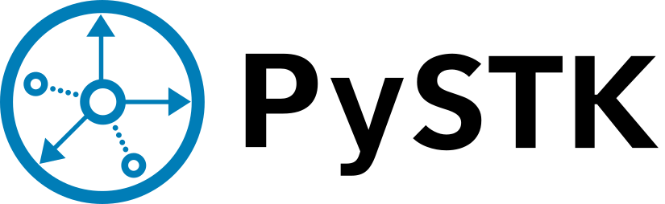

PySTK documentation |version|
#############################

PySTK provides a Python API to interact with `Ansys Systems Tool Kit`_ (STK).

   

.. grid:: 2

    .. grid-item-card:: Getting started :fa:`person-running`
        :link: getting_started/index
        :link-type: doc

        Step by step guidelines on how to set up your environment to work with
        PySTK. Build your own Docker image for STK, install PySTK, and verify
        your environment.

    .. grid-item-card:: User guide :fa:`book-open-reader`
        :link: user_guide/index
        :link-type: doc

        Learn about the capabilities, features, and key topics in PySTK. This
        guide provides useful background information and explanations.

.. jinja:: main_toctree

    
    .. grid:: 2
    
       
       .. grid-item-card:: API reference :fa:`book-bookmark`
           :link: api/index
           :link-type: doc
    
           A detailed guide describing the PySTK API. This guide documents all the
           methods and properties for each one of the interfaces, classes and
           enumerations of each one of the modules in PySTK.
        
      
       
       .. grid-item-card:: Gallery of examples :fa:`laptop-code`
           :link: examples
           :link-type: doc
    
           Learn how to use PySTK for creating custom applications and automating
           your existing STK workflows. This guide contains a gallery of examples
           showing how to integrate PySTK with other popular tools in the Python
           ecosystem.
        
    

.. jinja:: main_toctree

    .. toctree::
       :hidden:
       :maxdepth: 3
    
       getting_started/index
       user_guide/index
       
       examples
       
       
       api/index
       
