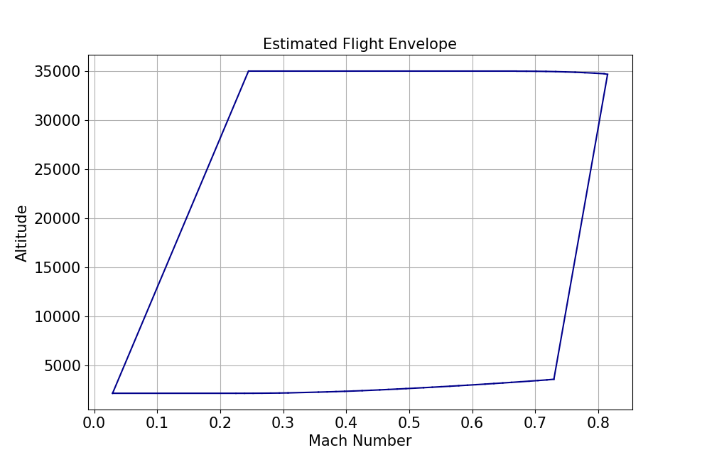
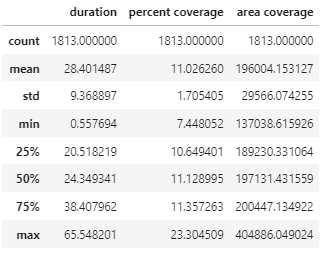
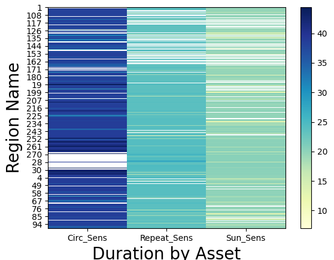

Data analysis
#############

This section details the Python data types that facilitate efficient data analysis when working with PySTK. As you interact with STK's simulation results, you may need to analyze large volumes of data. To accomplish this, you can leverage NumPy arrays and Pandas DataFrames. Together, NumPy arrays and Pandas DataFrames provide a suite of tools for managing and analyzing the data produced by STK. In this section, learn how to apply these data types to enhance your PySTK workflows.

NumPy arrays
============

NumPy arrays are a widely supported foundational data structure for numerical computations in Python. They enable high-performance, multi-dimensional data storage and operations, making them ideal for handling time-series data, matrices, and other numerical results generated by STK. By leveraging NumPy, you can perform vectorized operations, indexing, broadcasting, and complex mathematical analyses efficiently.

You can convert a dataset collection in row format to a NumPy array. The :py:meth:`~ansys.stk.core.stkobjects.DataProviderResultDataSetCollection.to_numpy_array` method, called on :py:class:`~ansys.stk.core.stkobjects.DataProviderResultDataSetCollection`, returns a data provider's results dataset collection as a 2D NumPy array. This array has a shape equal to the total number of rows in the dataset collection and the total number of unique columns fields in the dataset collection. For example, if the computed ``All Region By Pass`` data provider results dataset collection contains 100 rows and 11 column fields, the :py:meth:`~ansys.stk.core.stkobjects.DataProviderResultDataSetCollection.to_numpy_array` method would return a NumPy array of the entire result set and would have a shape of ``(100, 11)``, where 100 is the number of rows and 11 is the number of columns.

To use this capability, you must have `Numpy <https://numpy.org/>`_ installed in your local Python development environment.

The following example uses NumPy arrays for flight profile data.

.. literalinclude:: /../../tests/doc_snippets_tests/data_analysis/data_analysis_snippets.py
  :language: py
  :tab-width: 4
  :start-after: def FlightProfileNumpyArraySnippet
  :end-at: plt.grid(visible=True)
  :dedent:

The resulting flight data plot looks like this:

For more information, see `Numpy <https://numpy.org/>`_.

Pandas DataFrames
=================

Pandas DataFrames offer a powerful and flexible way to organize and manipulate structured data. Designed for handling tabular data, DataFrames enable you to store, filter, and transform simulation results. With Pandas, you can seamlessly work with time-indexed data, perform group-based analysis, and integrate your results with a wide range of data analysis and visualization tools.

You can convert a dataset collection in row format as a Pandas DataFrame. DataFrames are the key to Pandas' fast and efficient data manipulation and analysis. They are a two-dimensional, tabular data structure with labeled indexing for rows and columns, where the columns can contain data of various data types. DataFrames supports powerful aggregation and transformation capabilities, time series capabilities, merging operations of datasets, hierarchical indexing, vectorized operations, flexible reshaping capabilities, and much more.

The :py:meth:`~ansys.stk.core.stkobjects.DataProviderResultDataSetCollection.to_pandas_dataframe` method called on :py:class:`~ansys.stk.core.stkobjects.DataProviderResultDataSetCollection`, returns a data provider's results dataset collection as Pandas DataFrame. The DataFrame row index length, equal to the total number of rows in the dataset collection and each column in the DataFrame, maps to a unique field name in the dataset collection. For example, if the computed Flight Profile by Time data provider results dataset collection contains 6000 rows and 100 fields column fields, the returned DataFrame has a row index length of 6000 and 100 columns.

To use this capability, you must have `Pandas <https://pandas.pydata.org/>`_ installed in your local Python development environment.

Examples of using Pandas DataFrames
-----------------------------------

Example 1
^^^^^^^^^

This example provides the Python implementation for converting ``All Regions By Pass`` data provider results to a Pandas DataFrame with a default numeric row index.

.. literalinclude:: /../../tests/doc_snippets_tests/data_analysis/data_analysis_snippets.py
  :language: py
  :tab-width: 4
  :start-after: def CoverageDefinitionResultsToPandasDataFrameSnippet
  :end-at: coverage_df = coverage_data.data_sets.to_pandas_dataframe()
  :dedent:

The :py:meth:`~ansys.stk.core.stkobjects.DataProviderResultDataSetCollection.to_pandas_dataframe` method supports setting a single column as the index. To create a hierarchical index or a composite index comprised of more than a single column, get your data provider's results dataset collection as a Pandas DataFrame with the default numeric index, then update the index accordingly.

.. literalinclude:: /../../tests/doc_snippets_tests/data_analysis/data_analysis_snippets.py
  :language: py
  :tab-width: 4
  :start-after: def AccessResultsToPandasDataFrameSnippet
  :end-at: access_data_df = access_data.data_sets.to_pandas_dataframe(index_element_name=index_column)
  :dedent:

Example 2
^^^^^^^^^

This example provides the Python implementation for computing descriptive statistics access measurements.

.. literalinclude:: /../../tests/doc_snippets_tests/data_analysis/data_analysis_snippets.py
  :language: py
  :tab-width: 4
  :start-after: def DescriptiveStatisticsPandasDataFrameSnippet
  :end-at: all_regions_coverage_df[['duration', 'percent coverage', 'area coverage']].apply(pd.to_numeric).describe()
  :dedent:

This produces the following data table:

Example 3
^^^^^^^^^

This example provides the Python implementation for plotting a heat map of ``Duration By Asset`` for each access region.

.. literalinclude:: /../../tests/doc_snippets_tests/data_analysis/data_analysis_snippets.py
  :language: py
  :tab-width: 4
  :start-after: def CoverageDefinitionResultsPandasDataFrameHeatMapSnippet
  :end-at: plt.colorbar(orientation='vertical')
  :dedent:

This produces the following data map:

See `Pandas <https://pandas.pydata.org/>`_ for more information.