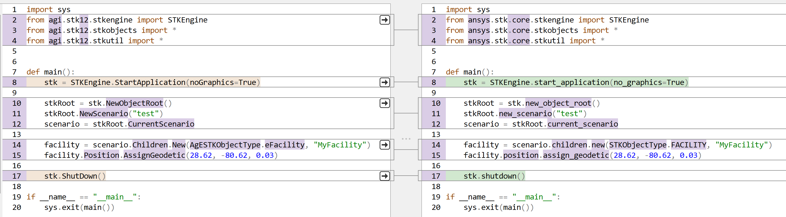

Migrate to PySTK
################

This topic describes how to migrate your existing Python code to PySTK, so that you can benefit from the improvements provided by the new API. This is useful if you have existing Python scripts based on the `STK API for Python <https://help.agi.com/stkdevkit/Content/python/pythonIntro.htm>`_ that is currently shipped with the Ansys STK® application install.

In general, the overall logic of the code is unchanged, but namespaces, classes, interfaces, enumerations, methods, and arguments have been renamed. Migrating your code consists of replacing the old names with the new names. The :ref:`migration table <Migration table>` provided on this page contains the mappings between the old names and the new names.

Updating your code manually by looking up the mappings one at a time can be time consuming. The :ref:`API Migration Assistant <API migration assistant>` included with the PySTK package facilitates this process.

API migration assistant
=======================

The API migration assistant automates migrating your code to the new API. It relies on a mix of dynamic and static analysis to locate the symbols that need to be updated in your code, and then performs the required edits. The dynamic analysis phase consists of running your application while recording the calls performed to the STK API. The static analysis phase uses the information recorded in the first phase to identify the methods and types that need to be renamed. It also renames imports, enumerations, and type hints by inspecting the source code.

.. warning::
    Before making changes to your existing code, ensure that you have committed all changes to your source control system.

The following steps are recommended:

1. Upgrade your code to STK software version 12.10.0.
2. Test your code using STK software version 12.10.0 to ensure it works properly.
3. Run the API migration assistant in recording mode. Repeat to cover all of the code paths.
4. Run the API migration assistant to apply the changes.
5. Review the changes.
6. If you are satisfied with the changes, rename the migrated files to overwrite the original files.
7. Test the migrated application.

The following diagram depicts this workflow:

.. mermaid::

    flowchart LR
        A[Start] --> B(Record trace)
        B --> C[/Are all the code paths covered?/]
        C -->|No| B
        C -->|Yes| D[Apply the changes]
        D --> E[Review *.py-migrated files]
        E --> F[Overwrite the original files]
        F --> G[Done!]

To illustrate this process, the examples below use a script in a file named `snippet.py`:

.. vale off

.. code-block:: python
    :linenos:

    import sys
    from agi.stk12.stkengine import STKEngine
    from agi.stk12.stkobjects import *
    from agi.stk12.stkutil import *

    def main():
        stk = STKEngine.StartApplication(noGraphics=True)

        stkRoot = stk.NewObjectRoot()
        stkRoot.NewScenario("test")
        scenario = stkRoot.CurrentScenario

        facility = scenario.Children.New(AgESTKObjectType.eFacility, "MyFacility")
        facility.Position.AssignGeodetic(28.62, -80.62, 0.03)

        stk.ShutDown()

    if __name__ == "__main__":
        sys.exit(main())

.. vale on

Record traces
~~~~~~~~~~~~~~~~

The first phase of the migration process is to record one or multiple traces of the execution of your Python application using the old STK API. Start the recording by invoking the API migration assistant with the following options:

.. code-block:: console

   $ pystk-migration-assistant record --recordings-directory=... snippet.py
   INFO: Recording ... snippet.py

The recordings are saved in the specified directory. Make sure to specify an empty directory if starting from scratch on migrating a new application.

By default, the API migration assistant executes the provided script and invokes ``main`` as an entry point. If you want to trigger the execution of a different entry point, use the ``--entry-point`` command line option.

If the ``--recordings-directory=`` option is not specified, a sub-directory named ``recordings`` is created in the current directory.

This creates an XML file in the recordings directory. That file contains the calls made by your script to the STK API. Here is how it looks in the case of the snippet used for this example:

.. code-block:: XML

    <!-- ... -->
    <recording root_directory="D:\Dev\api_migration_interceptor">
    <call filename="snippet.py" lineno="8" end_lineno="8" col_offset="10" end_col_offset="53" type_name="STKEngine" member_name="StartApplication"/>
    <call filename="snippet.py" lineno="10" end_lineno="10" col_offset="14" end_col_offset="33" type_name="STKEngineApplication" member_name="NewObjectRoot"/>
    <call filename="snippet.py" lineno="11" end_lineno="11" col_offset="4" end_col_offset="31" type_name="IAgStkObjectRoot" member_name="NewScenario"/>
    <call filename="snippet.py" lineno="12" end_lineno="12" col_offset="15" end_col_offset="38" type_name="IAgStkObjectRoot" member_name="CurrentScenario"/>
    <call filename="snippet.py" lineno="14" end_lineno="14" col_offset="15" end_col_offset="32" type_name="IAgStkObject" member_name="Children"/>
    <call filename="snippet.py" lineno="14" end_lineno="14" col_offset="15" end_col_offset="78" type_name="IAgStkObjectCollection" member_name="New"/>
    <call filename="snippet.py" lineno="15" end_lineno="15" col_offset="4" end_col_offset="21" type_name="IAgFacility" member_name="Position"/>
    <call filename="snippet.py" lineno="15" end_lineno="15" col_offset="4" end_col_offset="57" type_name="IAgPosition" member_name="AssignGeodetic"/>
    <call filename="snippet.py" lineno="17" end_lineno="17" col_offset="4" end_col_offset="18" type_name="STKEngineApplication" member_name="ShutDown"/>
    </recording>

There are also other options available to tweak recording. Use the ``--help`` command line argument to display them.

.. code-block:: console

    $ pystk-migration-assistant record --help
    usage: pystk-migration-assistant record [-h] [--entry-point <entry point>]
                                            [--root-directory <directory>]
                                            [--mappings-directory <directory>]
                                            [--recordings-directory <directory>] [-m]
                                            program ...

    positional arguments:
    program               script file or module (if -m flag) to record
    ...                   arguments passed to program in sys.argv[1:]

    options:
    -h, --help            show this help message and exit
    --entry-point <entry point>
                            entry point to invoke (default: main)
    --root-directory <directory>
                            only migrate files under this directory (default: program directory)
    --mappings-directory <directory>
                            directory containing the XML API mappings (default: D:\Dev\github_root\pyst
                            k\src\ansys\stk\core\tools\api_migration_assistant\api-mappings)
    --recordings-directory <directory>
                            directory receiving the XML recordings (default:
                            D:\Dev\github_root\pystk\recordings)
    -m                    invoke the specified program as a module

Note that the ``-m`` option is required if your program is a library module. Here is an example using ``pytest``:

.. code-block:: console

    $ pystk-migration-assistant record --root-directory=. -m pytest .
    INFO: Recording -m pytest .
    ================================== test session starts =================================
    platform win32 -- Python 3.12.7, pytest-8.3.4, pluggy-1.5.0
    rootdir: d:\Dev\api_migration_interceptor\test_stk
    plugins: cov-6.0.0, xdist-3.6.1
    collected 1 item

    test.py .                                                                         [100%]

    ================================== 1 passed in 17.95s ==================================

Apply the changes
~~~~~~~~~~~~~~~~~~~~

Once you have accumulated one or more traces to cover all of the paths in your Python application, you can apply the changes using the following command line:

.. code-block:: console

    $ pystk-migration-assistant record apply --recordings-directory=... snippet.py
    INFO: Applying changes from ...
    INFO: Writing ... snippet.py-migrated

This generates one ``.py-migrated`` file for each Python file in your application. Compare those files with the original files and tweak if needed. With the example, the diff looks like this:

There are additional options available to control how the changes are applied. Use the ``--help`` command line argument to display them.

.. code-block:: console

    $ pystk-migration-assistant apply --help
    usage: pystk-migration-assistant apply [-h] [--mappings-directory <directory>]
                                        [--recordings-directory <directory>]

    options:
    -h, --help            show this help message and exit
    --mappings-directory <directory>
                            directory containing the XML API mappings (default: ...)
    --recordings-directory <directory>
                            directory receiving the XML recordings (default:...)

Review, tweak, and accept
~~~~~~~~~~~~~~~~~~~~~~~~~

Review the suggested code changes. Once you are satisfied with the results, rename the ``.py-migrated`` files and overwrite your original files. Then retest the migrated application to ensure that the migration completed successfully.

Migration table
===============

The table below lists the interface, classes, enumerations, and method names that have been updated in PySTK. You can look up a specific name using the Search box to only display the rows that contain that symbol. Note that the root of the namespace has also changed from :py:attr:`agi.stk[version]` to :py:attr:`ansys.stk.core`.

.. jinja:: migration_table

    .. raw:: html

        <!-- Initialize DataTables -->
        

        <table id="migration-datatable" class="display" style="width: 100%" >
          <thead>
            <tr class="row-odd" role="row">
              <th class="head sorting_asc" tabindex="0" aria-controls="migration-table" rowspan="1" colspan="1" aria-sort="ascending" aria-label="Old name activate to sort column descending" style="width: 153.312px;">
                
Old name

              </th>
              <th class="head sorting" tabindex="0" aria-controls="migration-table" rowspan="1" colspan="1" aria-label="New name activate to sort column ascending" style="width: 153.312px;">
                
New name

              </th>
            </tr>
          </thead>
          <tbody>
            
            
            <tr>
                <td>
                    <b>{{ mapping }}</b>
                    
                         {{ "&nbsp;" * 8 }}{{ old_member }}
                    
                </td>
                <td>
                    <b>{{ mappings[mapping]["new_name"] }}</b>
                    
                         {{ "&nbsp;" * 8 }}{{ new_member }}
                    
                </td>
            </tr>
            
            
          </tbody>
        </table>

