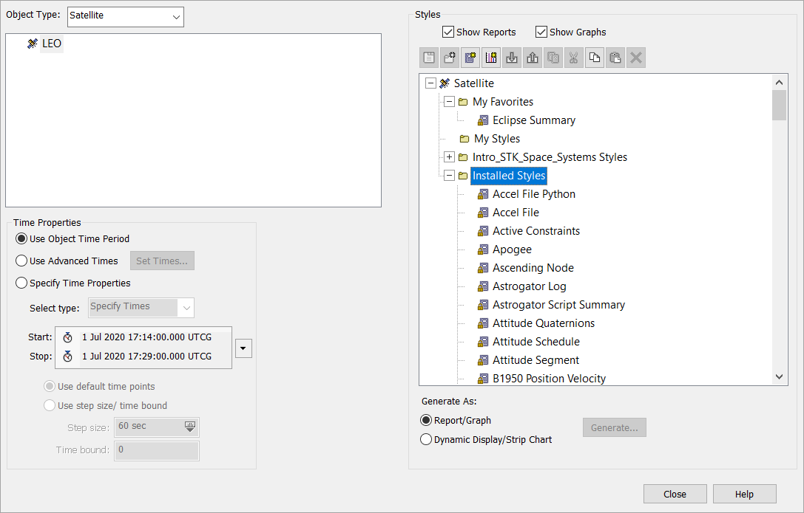
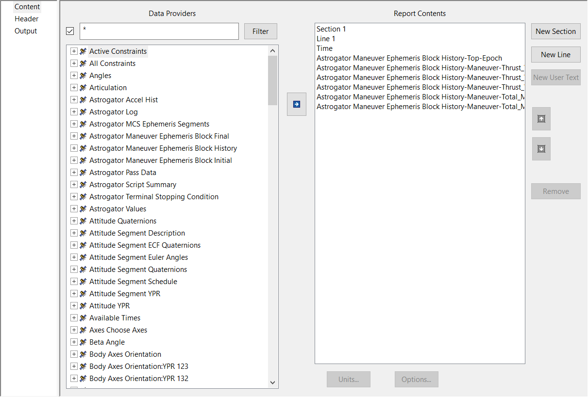
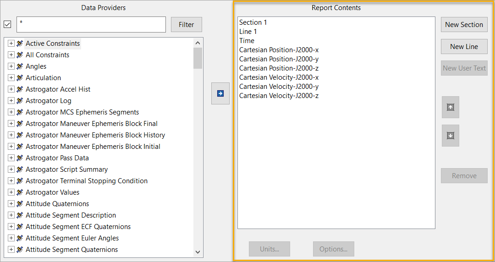
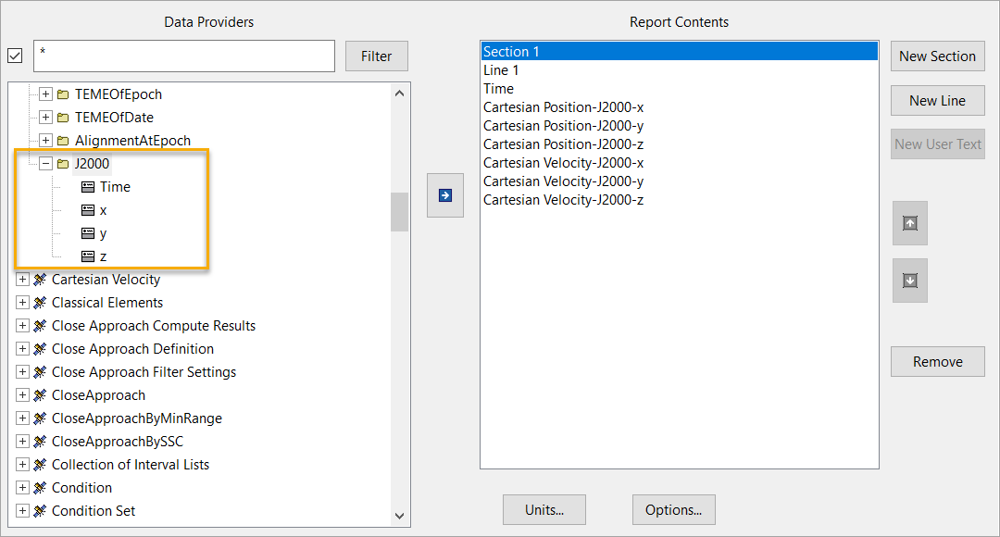

Results and graphs
##################

What are reports?
=================

Reports in STK are typically used to generate results like satellite positions, sensor coverage, or any time-dependent parameters. PySTK can be used to generate reports, extract their data, and export them to formats like CSV or Excel.

About STK data providers
========================

Data providers in STK are essential for accessing detailed, time-dependent data from objects and systems in a scenario. They are part of STK's object model and are key to extracting and manipulating information, such as satellite positions, sensor coverage, communication links, and more. By using the STK object model, PySTK can automate the retrieval of this data for processing, visualization, or reporting.

The content of a report or graph is generated from the selected data providers for the report or graph style.

Report styles
=============

To browse the various report styles available for a particular object in STK, and their corresponding data providers, right-click an object in the STK object browser and navigate to the `Graph and Report Manager` menu. In the manager dialog, expand the `Installed Styles` folder. This displays a list of the various report styles that are available for particular object.

To view the data providers being used by a particular report style, click a report style, and click the `Properties` button |prop-icon| to display the `Report Style` window.

Report contents
===============

In the `Report Contents` section of the `Report Style` window, the various data providers that are used to derive the particular report are listed. These data providers provide the actual data content to the report.

.. note:: The `Section`, `Line`, and `Time`` elements are used to provide formatting for the report style; they are not actual data providers.

Data providers
==============

In the `Data Providers` section of the `Report Style` window, the data providers available for a particular object are listed. Expand a particular group to view the nested data providers associated with that group. Expanding a particular data provider further to display the data Elements that are associated with it.

Groups, data providers, and elements are the organizing principles of the data provider capability provided by the STK object model.

To learn more about data providers, their results, and STK graphs and reports, explore `this example <../examples/results-graphs>`_.
